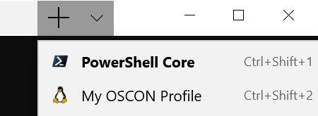

# Windows for Open Source Developers

This project walks you through setting up and customizing a Windows PC for Open Source development.  We'll introduce you to Windows Terminal and the Windows Subsystem for Linux (WSL) 2. At the end of this lab you'll use VS Code to debug a NodeJS project running in WSL. 

## Prerequisites

If you are **not** at an event, please see [REQUIREMENTS](REQUIREMENTS.md) to install the pre-requisites for this lab.

## Configure the Windows Terminal

### PROFILES

Open Windows Terminal (found in taskbar). Press `Ctrl+,` to edit the settings file (or use the Terminal menu and select "settings")

Scroll down to `"profiles"`. Insert the profile below after the first `[`: <br/> 
```json
{
    "guid" : "{c6eaf9f4-56a1-5fdc-b5cf-066e8a4b1e40}",
    "acrylicOpacity" : 0.5,
    "closeOnExit" : true,
    "colorScheme" : "Campbell",
    "commandline" : "wsl.exe -d Ubuntu-18.04",
    "cursorColor" : "#FFFFFF",
    "cursorShape" : "bar",
    "fontFace" : "Consolas",
    "fontSize" : 12,
    "historySize" : 9001,
    "icon" : "ms-appx:///ProfileIcons/{9acb9455-ca41-5af7-950f-6bca1bc9722f}.png",
    "name" : "My OSCON Profile",
    "padding" : "4, 2, 4, 2",
    "snapOnInput" : true,
    "useAcrylic" : false
        
},
```
Save the changes. `Ctrl+s`

On the Windows Terminal, select the down arrow next to the plus(+) sign as shown in this image. In the drop down, select: `My OSCON Profile`. 



This profile will open an Ubuntu 18 bash shell. 

Feel free to change any of the profile settings and the Terminal will automatically reload with your changes as you make them.

### POWERLINE FONT
Next we're going to install PowerLine fonts in Windows using PowerShell: 
1. git clone https://github.com/powerline/fonts.git
2. cd fonts
3. ./install.ps1 pro*

Next change your terminal profile to use one of the Powerline fonts:

`"fontFace" : "ProFont for Powerline",`

Save the changes `Ctrl+s`

### POWERLINE SHELL
With the fonts installed, you can install the PowerLine shell in Ubuntu.

> Do we need to have the user install the powerline shell? Adding the text to the bash profile will cause an error w/o the shell installed. To install the shell, it requires installing python and python-setuptools.
> yosef: let's install python, python-setuptools, and the shell for them as part of the base lab image.

Open Windows File Explorer.
In the Address bar enter `\\wsl$\Ubuntu-18.04\home\oscon`
Edit (Double-click) .bashrc -> Opens in VS Code
Add the following:

```bash
function _update_ps1() {
    PS1=$(powerline-shell $?)
}

if [[ $TERM != linux && ! $PROMPT_COMMAND =~ _update_ps1 ]]; then
    PROMPT_COMMAND="_update_ps1; $PROMPT_COMMAND"
fi
```
Save the changes. `Ctrl+s`


## TMUX
> Is this the Windows Terminal or Ubuntu?

To have multiple panes within our Ubuntu 18 shell we can use Tmux.  Here's how:
1. From the Ubuntu 18 shell run `sudo apt install tmux -y` (password: oscon)
2. Open a new tmux session by typing `tmux` and pressing enter
3. Add panes using the following:
    - Press **CTRL+B** and then **"** to split the screen vertically
    - Press **CTRL+B** and then **%** to split the screen horizontally
    - Use **CTRL+B** and then the arrow keys to navigate between the screens
    - Use whatever mix and match of cool apps you'd like here. I recommend using `htop` in the top Window, `cmatrix` on the bottom left and `cacafire`
    - To quit a window press **CTRL+B** and then **x** and then press **y** to accept. 
    - Quit all windows to exit the tmux session.

## Run a Node Project in WSL
> Needed to install Node and npm for this to work. Had to update the Ubuntu build before I could install node and npm. There's no projects folder under C:\\ either.

>yosef: I agree shoudl include the project in the base image, and the clean up command can just remove the node-modules folder

In the Terminal using your OSCON profile, navigate to
 `c:\\projects\`
1. run `cd node-shopping-cart`
2. run `npm install`
3. run `npm start`
4. Use a web browser to open `localhost:3000` to see the site is working.  You are now running  the Linux version of NodeJS locally on Windows via WSL. 

### STARTING DIRECTORY
You can add the following line to your Terminal profile, so now it will open to your project folder:

`"startingDirectory" : "C:\projects\node-hello"`

### Debug the Node Project with VS Code
1. Open the Ubuntu 18 bash shell and type `code .` to open the project in VS Code
2. This opens VS Code on Windows with a feature to debug the NodeJS project running in WSL
3. In VS Code you can run the debugger and use breakpoints.  You're using a Windows code editor/debugger for a project running the Linux NodeJS.  Pretty cool!

Thank you for trying out Windows Terminal and WSL.  To learn more please check out the following resources.

## Resources
- https://aka.ms/learnwsl
- https://github.com/microsoft/terminal

