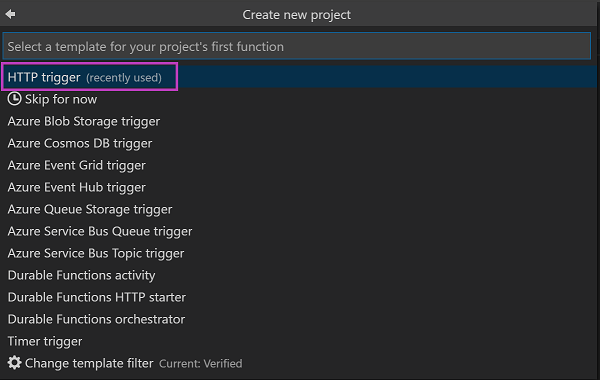

# Use Azure Functions to build a RESTful API

Create an Azure Functions serverless API that returns a list of pets to be adopted. In this lab, you will learn how to create a basic REST API using Node.js Azure Functions and add dependencies from npm.

## Prerequisites

If you are **not** at an event, please see [REQUIREMENTS](REQUIREMENTS.md) to install the prerequisites for this lab.

## Create a Function App

Use the Azure Functions extension to create a new function app. 

* Start by navigating to the Azure view in Visual Studio Code (the on the left-hand side), then click the Create New Project button (the in the explorer).


* Choose the current workspace to create the Function App then 

- Choose JavaScript when prompted for the language of the Function App

- Choose HTTP Trigger when prompted to create the first Azure Function in the Function App

- Name the Function "pets"

- Choose Anonymous for the authorization level


* Select **Open in current window**


The Function App is created and the HTTP Function you just created is opened in the editor windows of Visual Studio Code.

## Test the default Function in the browser

The Azure Functions extension created all required configuration for running your Function App locally. 

* Start Debug with **Fn+F5** or by choosing Debug, Start Debugging from the menu.

The Debug will automatically *run npm install* and start the Azure Functions host. 

* Hold the Control key and click the URL or goto `http://localhost:7071/api/pets` in a browser. 
You should see a message that says “Please pass a name on the query string or in the request body”. 

* Add the `name` query parameter by updating the URL to include `?name=OSCON`. Press **Enter** and now the page should say: "Hello OSCON"

* Stop Debug: **Shift+Fn+F5** or Stop Debugging from the Debug menu

## Finding pets for adoption

Now we'll update the Function to pull a list of pets that are available for adoption. 

* Open a Terminal Window from the Terminal menu or **Ctrl+Shift+`** 
* Install the `pet` module from npm by running `npm install @frontendmasters/pet --save`. 

* Replace the code in the index.js with:

```js
const pet = require("@frontendmasters/pet");

module.exports = async function(context, req) {
  const response = await pet.animals();

  if (!response.animals)
    return (context.res = {
      status: 500,
      body: response.message
    });

  context.res = {
    body: response.animals
  };
};
```
* Start Debug with **Fn+F5** or by choosing Debug, Start Debugging from the menu.

> Note: if the module fails to make the request to get available animals, the endpoint needs to handle that error and send an appropriate status code and response.

> JJ - Are we saying the user needs to handle the error response? It fails the first time, so the user needs to run Debug again to start up?

* Start Debug again and load the URL `http://localhost:7071/api/pets`. This time, you'll see an JSON array of pets along with links to photos and more information for each.

At this point, you can hook a front-end up to you API and start helping lovely animals find happy homes!

## Next steps

- [Sample app with an Angular front end connected to Azure Functions](https://github.com/fiveisprime/apm)
