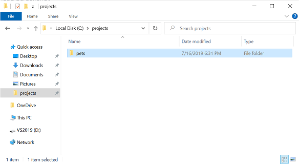
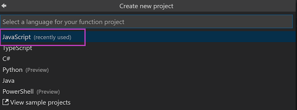
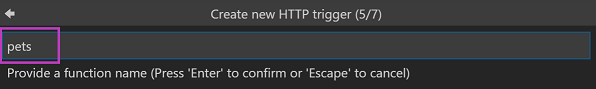
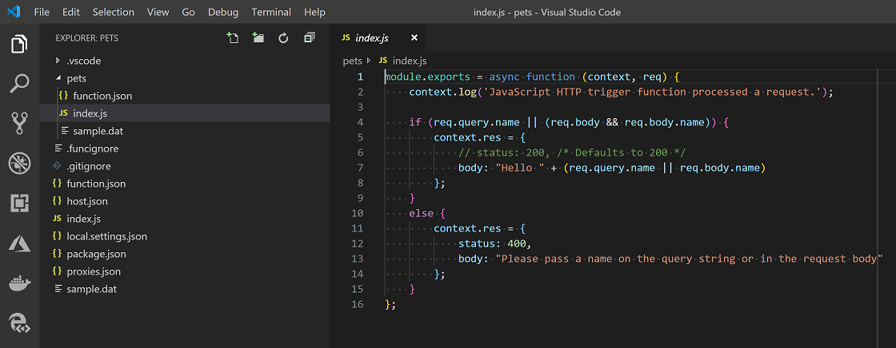
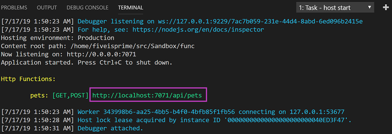
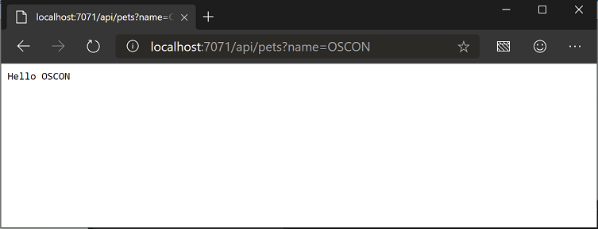

# Use Azure Functions to build a RESTful API


Create an Azure Functions serverless API that returns a list of pets to be adopted. In this lab, you will learn how to create a basic REST API using Node.js Azure Functions and add dependencies from npm.

## Prerequisites

If you are **not** at an event, please see [REQUIREMENTS](REQUIREMENTS.md) to install the prerequisites for this lab.

## Create a Function App

Use the Azure Functions extension to create a new function app.

- Open Visual Studio Code Insiders
- In the Activity bar (on left side), select the Azure icon
- Click the Create New Project button (the in the explorer)


- Select _projects/pets_ folder from the



Now the _Create new project_ wizard appears, enter the following

- Select **JavaScript** for the language of the Function App



- Select **HTTP trigger** for the template


- Replace the default function name **HttpTrigger** with **pets**



- Select **Anonymous** for the _Authorization level_


- Select **Open in current window**

The HTTP Trigger function just created is opened in the editor window.



## Run the Function locally

Using a template to create the function, creates a working Http Trigger function we can test locally.<br>
Let's try it now:

- In the Menu bar, select **Start Debugging** from the _Debug_ menu or press **Fn+F5**

A Terminal opens with the debug output.

> Debug automatically excutes _run npm install_, to install any depencies, and starts the Azure Functions host.

Once the host is started, the URL appears.



Hold **Crtl** while click the URL or type `http://localhost:7071/api/pets` in a browser.

> You'll see a message that says "Please pass a name on the query string or in the request body"

- Add a query parameter, `name`, to the URL, `?name=OSCON`, press **Enter** and now the page shows: "Hello OSCON"
  > `http://localhost:7071/api/pets?name=OSCON`



In the Menu bar, select **Stop Debugging** from the Debug menu or press **Shift+Fn+F5**

## Finding pets for adoption

Now we'll update the function to pull a list of pets that are available for adoption using a module from npm that uses a Pet Finder API with a specific configuration.

- Open a **Terminal Window** from the _Terminal_ menu or **Ctrl+Shift+`**

- In the Terminal, install the `pet` module from npm by running `npm install @frontendmasters/pet --save`.

- Replace the default code in the `index.js` with:

```js
const pet = require("@frontendmasters/pet");

module.exports = async function(context, req) {
  const response = await pet.animals();

  if (!response.animals)
    return (context.res = {
      status: 500,
      body: response.message
    });

  context.res = {
    body: response.animals
  };
};
```

Now test your new code:

- In the Menu bar, select **Start Debugging** from the _Debug_ menu or press **Fn+F5**
- Start Debug again and load the URL `http://localhost:7071/api/pets`
  > This time, you'll see a JSON array of pets along with links to photos and more information for each

At this point, you can hook a front-end up to you API and start helping lovely animals find happy homes!

In the Menu bar, select **Stop Debugging** from the Debug menu or press **Shift+Fn+F5**

## Next steps

- [Sample app with an Angular front end connected to Azure Functions](https://github.com/fiveisprime/apm)
