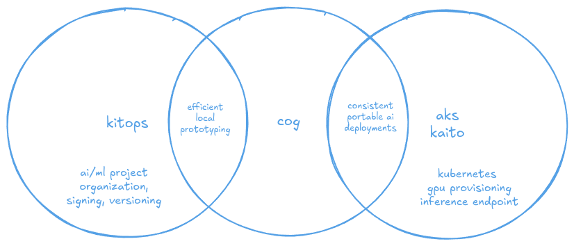

# BYO model on AKS with KAITO and open-source tools

Being able to self-host open-source models on Kubernetes is a powerful way to leverage the latest advancements in AI/ML while maintaining control over your data and infrastructure. With Kubernetes comes the flexibility to leverage a wide range of tools and frameworks within the cloud-native ecosystem. In this workshop, we will explore how to deploy open-source models on [Azure Kubernetes Service (AKS)](https://learn.microsoft.com/azure/aks/what-is-aks) using [KAITO](https://github.com/kaito-project/kaito), a CNCF Sandbox project that simplifies the deployment of AI applications on Kubernetes. We'll also look at other open-source tools like [KitOps](https://kitops.org/docs/overview/), another CNCF Sandbox project that standardizes how AI/ML projects are organized, versioned, and stored within OCI-compliant registries, and [Cog](https://cog.run/) to build production-ready containers for model inference.

This guide will walk you through the process of running any open-source model on Azure Kubernetes Service (AKS) with KAITO.

By the end of this walkthrough, you will be able to:

1. Deploy an AKS cluster with KAITO installed and attach Azure Container Registry (ACR) with Terraform CLI
1. Bootstrap a new ModelKit project by downloading an open-source model from HuggingFace with Kit CLI
1. Create a model inferencing project with Cog CLI
1. Build and push Cog app container image to ACR with Cog CLI
1. Pack and push ModelKit (model and inference code) to ACR with Kit CLI
1. Self-host Cog model inferencing application on AKS with KAITO

## Pre-requisites

Before you begin, you will need the following tools installed.

- [Azure CLI](https://learn.microsoft.com/cli/azure/install-azure-cli) for managing Azure resources.
- [Terraform](https://developer.hashicorp.com/terraform/install) for provisioning Azure resources.
- [Docker](https://www.docker.com/get-started/) for building and running container images.
- [KitOps CLI](https://kitops.org/docs/cli/installation/) for managing ModelKits.
- [Cog CLI](https://cog.run/getting-started/#install-cog) for building and running containerized inference applications.
- [kubectl](https://kubernetes.io/docs/tasks/tools/#kubectl) for managing Kubernetes resources.
- [Python](https://www.python.org/downloads/) for developing the model inference code.
- [jq](https://jqlang.org/) for parsing JSON.
- [curl](https://curl.se/) for making HTTP requests.

> [!TIP]
> This workshop can be run on any local machine with the above tools installed. However, if you are facing challenges with local compute power or network bandwidth limitations, you can run this workshop on an Azure Virtual Machine. Check out this [README](./workstation/README.md) for instructions on how to set up a VM with all the tools pre-installed. With the VM in place, SSH into the node and proceed with the rest of this walk-through.

## More tools?

In this workshop, "**BYO**" can mean "**Bring Your Own**" model or "**Build Your Own**" model. Whatever the case, the goal here is to show how you can leverage open-source tools as part of your development lifecycle. In the cloud-native ecosystem, there are many tools available for managing AI/ML workloads. Each tool has its own areas of focus, and they often complement each other. Here's how I view the this tool stack (KitOps, Cog, and KAITO) and how they complement each other in the context of a complete AI/ML workflow:



- **KitOps**: Used to organize, version, sign, and store AI/ML projects in OCI-compliant registries. Every step of the model lifecycle can be captured in a ModelKit and can be used to track the model's lineage then shared with others.
- **Cog**: Used to build production-ready containers for model inference. It provides a simple way to define the model inference code and dependencies, and it can be used to build and push the container image to a registry. Cog also provides a CLI for running predictions against the model locally creating a fast and efficient developer feedback loop. This code can also be stored in the ModelKit, allowing you to version the inference code alongside the model.
- **KAITO**: Once the code is ready for production, AKS with KAITO can be used to deploy the model inference application on Kubernetes. With Kubernetes comes the ability to orchestrate the deployment of the model inference application, scale it up or down based on demand, and manage the resources needed to run the application. All the things that Kubernetes does best.

## Getting started

> [!CAUTION]
> Before you begin, ensure you have an Azure subscription with sufficient quota to provision an Azure Kubernetes Service (AKS) cluster and GPU nodes. The following GPU SKU families are supported for KAITO on AKS:
>
> - Standard NCSv3 (NVIDIA V100 GPU)
> - Standard NCASv3_T4 (NVIDIA T4 GPU)
> - Standard NCADS_A100_v4 (NVIDIA A100 GPU)
> - Standard NCadsH100v5 (NVIDIA H100 GPU)
> - StandardNDISRH200V5 (NVIDIA H200 GPU)
> - Standard NV (NVIDIA M60 GPU)
> - Standard NVSv3 (NVIDIA M60 GPU)

To run this solution on AKS, use the Terraform script found in the KAITO repository which will provision the following services.

- [Azure Kubernetes Service (AKS)](https://learn.microsoft.com/azure/aks/what-is-aks)
- [Azure Container Registry (ACR)](https://learn.microsoft.com/azure/aks/cluster-container-registry-integration?tabs=azure-cli)
- [Azure User-Assigned Managed Identity](https://learn.microsoft.com/entra/identity/managed-identities-azure-resources/how-manage-user-assigned-managed-identities?pivots=identity-mi-methods-azp)

### Provision AKS and install KAITO

Head over to the [KAITO repo](https://github.com/kaito-project/kaito), clone the project, and run the [Terraform script](https://github.com/kaito-project/kaito/tree/main/terraform).

```sh
git clone https://github.com/kaito-project/kaito.git
cd kaito/terraform
terraform init
```

In order to deploy to Azure you must be logged in to the Azure CLI.

```sh
az login --use-device-code
```

Export the Azure subscription ID to an environment variable.

```sh
export ARM_SUBSCRIPTION_ID=$(az account show --query id -o tsv)
```

Review the location variable in the `variables.tf` file and update accordingly, then run Terraform to provision resources.

```sh
terraform apply
```

This deployment will provision the cluster and install the KAITO Workspace and GPU Provisioner operators into the cluster via Helm.

Run the following command to export the outputs.

```sh
export RG_NAME=$(terraform output -raw rg_name)
export AKS_NAME=$(terraform output -raw aks_name)
```

Log in to AKS cluster:

```sh
az aks get-credentials -g $RG_NAME -n $AKS_NAME
```

Log in to ACR:

```sh
# get the acr name
export ACR_NAME=$(az acr list -g $RG_NAME --query "[0].name" -o tsv)

# get the acr login server url
export ACR_LOGIN_SERVER=$(az acr show -g $RG_NAME -n $ACR_NAME --query loginServer -o tsv)

# login to acr
az acr login -n $ACR_NAME
```

## Organize with KitOps

As mentioned above, [KitOps](https://kitops.org/) is an open-source project within the CNCF Sandbox that aims to standardize how AI projects are organized, versioned, and stored within OCI-compliant registries. We'll use the Kit CLI developed by friends at [jozu.ml](http://jozu.ml) to bootstrap our ModelKit project. The [ModelKit](https://kitops.org/docs/modelkit/intro/) is an emerging standard for packaging AI models, code, datasets, documentation and associated metadata, making it easier to share and deploy models across different platforms.

Navigate back to your home directory.

```sh
cd ~/
```

Create a new working directory.

```sh
mkdir mysmollm2app
cd mysmollm2app
```

Initialize a ModelKit by [importing a model](https://kitops.org/docs/cli/cli-reference/#kit-import) from HuggingFace. In this example, we’ll use the 16k context version of the [SmolLM2-1.7B-Instruct](https://huggingface.co/HuggingFaceTB/SmolLM2-1.7B-Instruct-16k) LLM. Update the manifest when asked to set the name, author, description.

```sh
kit import https://huggingface.co/HuggingFaceTB/SmolLM2-1.7B-Instruct-16k
```

The ModelKit is now initialized and the model files are stored in a local directory. You can view ModelKits in the local registry by running the following command.

```sh
kit list
```

To start working with the model files and build a model inference application, we need to [unpack](https://kitops.org/docs/cli/cli-reference/#kit-unpack) the ModelKit to the current directory.

```sh
kit unpack huggingfacetb/smollm2-1.7b-instruct-16k:latest
```

## Predict with Cog

[Cog](https://cog.run/) is another open-source project developed by friends at [Replicate](https://replicate.com/) and this project aims to standardize how AI/ML projects are packaged into production-ready containers. It provides a CLI that allows you to initialize Cog projects, which provides base images for Docker containers and includes boilerplate code to write inferencing calls against local models.

### Cog setup

Let's code the AI model prediction code using Cog and place the code within our KitOps ModelKit project. Run the following code to create a directory for the source code and [initialize a new Cog project](https://cog.run/getting-started-own-model/#initialization).

```sh
mkdir -p src/cog
cd src/cog
cog init
```

Next we need to add Python dependencies to the project. [Cog uses a requirements.txt file to define the Python packages needed for the project](https://cog.run/yaml/#python_requirements). Open the requirements.txt file and replace the contents with the following packages.

```txt
torch==2.6.0
transformers==4.49.0
accelerate==1.5.2
```

To [define how the container image will be built](https://cog.run/getting-started-own-model/#define-the-docker-environment), [Cog uses a YAML file called cog.yaml](https://cog.run/yaml/) which contains configuration for the build process, the prediction code, and the container image name.

Open the cog.yaml file and replace the YAML with the following config to define the Docker environment.

```yaml
build:
  gpu: true
  cuda: "12.4"
  python_version: 3.12
  python_requirements: requirements.txt
predict: "predict.py:Predictor"
image: "mysmollm2app"
```

You can see that we are defining the [build environment](https://cog.run/yaml/#build) to use [GPU](https://cog.run/yaml/#gpu) with CUDA 12.4, Python 3.12, and the [requirements.txt file](https://cog.run/yaml/#python_requirements) we just created. The predict key defines the entry point for the prediction code, which will be defined in the next step. Finally, we define the image name that will be used when building the container.

### Cog predictions

Now, we can start writing the [prediction code in Python](https://cog.run/python/). The [prediction code](https://cog.run/getting-started-own-model/#define-how-to-run-predictions) will be responsible for loading the model from a local directory and running predictions against it. It uses the [Hugging Face Transformers library](https://huggingface.co/docs/transformers/index) to load the model and run predictions. The code will be written in a Python class that inherits from `BasePredictor` provided by Cog.

Open the predict.py file, replace the code with the following, and save the file.

```python
from cog import BasePredictor, Input
from transformers import AutoModelForCausalLM, AutoTokenizer
import os

class Predictor(BasePredictor):
    def setup(self) -> None:
        """Load the model into memory to make running multiple predictions efficient"""
        model_path = os.getenv("MODEL_PATH", "../../") # locally the model is in the root directory
        self.tokenizer = AutoTokenizer.from_pretrained(model_path)
        self.model = AutoModelForCausalLM.from_pretrained(
            model_path,
            device_map="auto",  # Automatically distributes across available GPUs or uses CPU
            trust_remote_code=True
        )

    def predict(
        self,
        prompt: str = Input(description="Ask the LLM a question"),
    ) -> str:
        """Run a single prediction on the model"""
        inputs = self.tokenizer(prompt, return_tensors="pt", padding=True).to(self.model.device)

        outputs = self.model.generate(
            input_ids=inputs.input_ids,
            max_length=100,
            do_sample=True,
            top_p=0.95,
            temperature=0.3,
            attention_mask=inputs.attention_mask
        )

        response = self.tokenizer.decode(outputs[0], skip_special_tokens=True)
        return response
```

### Cog containers

The application is ready to be packaged into a container. Run the following command to [build the container image](https://cog.run/getting-started/#build-an-image) with the Cog CLI.

```sh
cog build
```

> [!NOTE]
> To view the Dockerfile that Cog generates, you can run the `cog debug` command.

At this point, we could test this locally using cog predict or docker run commands, but we'll sidestep that and go straight to AKS.

## Deploy the app to AKS

Let's run and test the application on the Azure infrastructure we provisioned using Terraform.

> [!WARNING]
> Make sure you have environment variables set for the Azure resources before proceeding.

### Push Cog container to ACR

The [cog build command](https://cog.run/getting-started/#build-an-image) created a container image. This container image is now in the local Docker registry, so we can simply run docker commands to tag and push the Cog application. But you can also use the `cog push` command to push the image to an OCI-compliant registry as long as you are logged in to the registry and tag the image with the registry URL.

Run the following command to push the image to ACR using the Cog CLI.

```sh
cog push $ACR_LOGIN_SERVER/mysmollm2app:latest
```

### Push ModelKit to ACR

Recall that when we imported and unpacked the model using the Kit CLI, a ModelKit was created. The Cog container will not have the model included in the image, so we need to pack up the ModelKit and push it to an OCI-compliant registry as well.

But first, with a new **src/cog** folder in place for our Cog code, we need to update the ModelKit project to make it aware of the code.

Return to the root directory.

```sh
cd ../../
```

Open the Kitfile and add a new code spec at the end. Your YAML manifest should look something like this.

```yaml
manifestVersion: 1.0.0
package:
  name: mysmollm2app
  authors:
    - Paul Yu
  description: My project working with HuggingFaceTB/SmolLM2-1.7B-Instruct-16k model
model:
  name: model
  path: model.safetensors
  parts:
    - path: training_args.bin
    - path: all_results.json
    - path: config.json
    - path: generation_config.json
    - path: merges.txt
    - path: special_tokens_map.json
    - path: tokenizer.json
    - path: tokenizer_config.json
    - path: train_results.json
    - path: trainer_state.json
    - path: vocab.json
docs:
  - path: README.md
    description: Readme file
code:                                                       # Add code spec
  - path: src/cog/
    description: Source code to run AI model predictions
```

> [!NOTE]
> See [Kitfile reference](https://kitops.org/docs/kitfile/format/#example) for more details on the Kitfile format.

Now we can [pack up the ModelKit](https://kitops.org/docs/cli/cli-reference/#kit-pack) and label it so that it can be pushed to the Azure Container Registry (ACR). Run the following command to pack up the ModelKit. This will pack up everything defined in the Kitfile.

```sh
kit pack . -t $ACR_LOGIN_SERVER/modelkits/mysmollm2:latest
```

The ModelKit will be stored in the ACR under the **modelkits/mysmollm2** repository, and we will tag it with a version number.

To push the ModelKit to ACR, we need to log in to the ACR with the Kit CLI. Run the following commands to create an ACR token to use for Kit CLI authentication and push the ModelKit to ACR.

```sh
# create token for push
ACR_TOKEN_NAME=kitpush
ACR_TOKEN_PASSWORD=$(az acr token create \
-n $ACR_TOKEN_NAME \
-r $ACR_NAME \
--scope-map _repositories_push \
--query "credentials.passwords[0].value" \
-otsv)

# login to acr
echo $ACR_TOKEN_PASSWORD | kit login $ACR_LOGIN_SERVER -u $ACR_TOKEN_NAME --password-stdin
```

> [!NOTE]
> At the time of this writing, the Kit CLI does not support bearer token authentication, so it is unable to use the same token that was retrieved when we logged in to ACR with the Azure CLI. So we will need to create a token in ACR that can be used for pushing the ModelKit.

Now we can push the ModelKit to ACR using the Kit CLI.

```sh
kit push $ACR_LOGIN_SERVER/modelkits/mysmollm2:latest
```

### Build a KitOps container for pulling ModelKits

As mentioned above, the Cog container will not have the model files included in the image. It just expects the model to be locally available. So we need to ensure that the model files are available in the Pod before the Cog application starts. One solution to this is to use an initContainer that will run before the main application container starts. The initContainer will be responsible for pulling the ModelKit from the ACR and unpacking it to a local directory in the Pod.

With the model being stored in the ModelKit, we can use the KitOps CLI to pull and unpack the ModelKit from the ACR. The KitOps supports this sort of workflow; however, they don't publish a container image that can be used to authenticate to a private registry and pull the ModelKit. So we will need to create a custom container image that can be used as an initContainer in the Pod.

Create a custom container image to pull and unpack ModelKits from private registries. We'll be taking inspiration from [this example](https://github.com/kitops-ml/kitops/tree/main/build/dockerfiles/init).

```sh
mkdir src/kitops
cd src/kitops
```

Next run the following command to create a new file called **Dockerfile**.

```sh
touch Dockerfile
```

Open the Dockerfile and add the following code.

```Dockerfile
FROM alpine:latest
RUN wget https://github.com/jozu-ai/kitops/releases/latest/download/kitops-linux-x86_64.tar.gz && \
  tar -xzvf kitops-linux-x86_64.tar.gz && \
  mv kit /usr/local/bin/

# Set default values for environment variables
ENV UNPACK_PATH=/home/user/modelkit/
ENV UNPACK_FILTER=model

CMD echo $PASSWORD | kit login $REGISTRY_URL -u $USERNAME --password-stdin && \
  kit unpack "$MODELKIT_REF" --dir "$UNPACK_PATH" --filter="$UNPACK_FILTER"
```

This Dockerfile takes inspiration from the one found in the [KitOps repository](https://github.com/kitops-ml/kitops/blob/main/build/dockerfiles/release.Dockerfile), but includes additional steps to log in to the ACR using the environment variables that will be set in the Pod and unpack the ModelKit to a local directory in the Pod. The environment variables `MODELKIT_REF`, `UNPACK_PATH`, and `UNPACK_FILTER` will be set in the Pod spec when we create the Workspace resource.

Build and push the init container.

```sh
docker build -t $ACR_LOGIN_SERVER/kitunpacker:latest .
docker push $ACR_LOGIN_SERVER/kitunpacker:latest
```

### Deploy custom model workspace

Recall that KAITO was installed in the AKS cluster and it provides a custom resource definition (CRD) for managing Workspaces. A Workspace is a custom resource that defines the resources needed to run an AI application, including the instance type, label selector, and inference template.

With KAITO workspace CRD deployed in the cluster, all we need to do is create a custom resource called a Workspace and KAITO will take care of provisioning a GPU-based node, deploying the application in a Pod and exposing it with a Service.

The Pod deployment in the workspace will leverage the KitOps initContainer to pull and unpack the model from the ModelKit. But we haven't created an ACR token yet that will be used by the initContainer to pull the ModelKit from the ACR. So we need to create a Kubernetes secret that will be used in the initContainer configuration.

Run the following commands to create a separate ACR token to pull ModelKits from ACR.

```sh
# create token for pull
ACR_TOKEN_NAME=kitpull
ACR_TOKEN_PASSWORD=$(az acr token create \
-n $ACR_TOKEN_NAME \
-r $ACR_NAME \
--scope-map _repositories_pull \
--query "credentials.passwords[0].value" \
-otsv)

# create kubernetes secret which will be used in the initContainer config
kubectl create secret generic kitops-init-token \
--from-literal=REGISTRY_URL=$ACR_LOGIN_SERVER \
--from-literal=USERNAME=$ACR_TOKEN_NAME \
--from-literal=PASSWORD=$ACR_TOKEN_PASSWORD
```

Now we can create a Workspace resource with a custom Pod template that will use the KitOps initContainer to pull and unpack the ModelKit from ACR. The Pod template will also include the Cog application container that will run the inference server.

Run the following command to create a Workspace.

```yaml
kubectl apply -f - <<EOF
apiVersion: kaito.sh/v1alpha1
kind: Workspace
metadata:
  name: mysmollm2app-workspace
resource:
  instanceType: Standard_NC4as_T4_v3  # Change this to a different GPU VM size if needed
  labelSelector:
    matchLabels:
      apps: mysmollm2app
inference:
  template:
    spec:
      initContainers:
        - name: kitops-init
          image: $ACR_LOGIN_SERVER/kitunpacker:latest
          envFrom:
            - secretRef:
                name: kitops-init-token
          env:
            - name: MODELKIT_REF
              value: "$ACR_LOGIN_SERVER/modelkits/mysmollm2:latest"
            - name: UNPACK_PATH
              value: /tmp/mymodelkit
            - name: UNPACK_FILTER
              value: model
          volumeMounts:
            - name: modelkit-storage
              mountPath: /tmp/mymodelkit    
      containers:
        - name: mysmollm2app
          image: $ACR_LOGIN_SERVER/mysmollm2app:latest
          env:
            - name: MODEL_PATH
              value: "/mymodel"
          resources: {}
          ports:
            - containerPort: 5000
          volumeMounts:
            - name: modelkit-storage
              mountPath: /mymodel
            - name: dshm
              mountPath: /dev/shm
      volumes:
        - name: modelkit-storage
          emptyDir: {}
        - name: dshm
          emptyDir:
            medium: Memory
EOF
```

> [!CAUTION]
> Ensure you have GPU quota in your Azure subscription for the `Standard_NC24ads_A100_v4` VM size. If you do not have GPU quota, you can change the `instanceType` to a different VM size that is available in your subscription.

Once KAITO processes this custom resource, it will begin provisioning a new GPU node, attaching it to the cluster and deploying a new Pod. As the new Pod is being rolled out, the initContainer will be responsible for downloading the model to a local directory and making it available for the Cog inference server.

Reference: [https://kitops.org/docs/deploy/](https://kitops.org/docs/deploy/) and [https://github.com/kaito-project/kaito/blob/main/docs/custom-model-integration/custom-deployment-template.yaml](https://github.com/kaito-project/kaito/blob/main/docs/custom-model-integration/custom-deployment-template.yaml)

Watch the Workspace roll out and wait for the RESOURCEREADY status to show True.

```sh
$ kubectl get workspace -w
NAME                     INSTANCE                   RESOURCEREADY   INFERENCEREADY   JOBSTARTED   WORKSPACESUCCEEDED   AGE
mysmollm2app-workspace   Standard_NC24ads_A100_v4   True            True                          True                 8m6s
```

Once the Workspace resource is ready, the Pod will begin to roll out.

Watch the Pod rollout and wait for the status to show Running.

```sh
$ kubectl get pod
NAME                                      READY   STATUS    RESTARTS   AGE
mysmollm2app-workspace-5c4695c9f7-44mkp   1/1     Running   0          17m
```

When the Pod is running you can also confirm the Service is deployed as well.

```sh
$ kubectl get svc
NAME                     TYPE        CLUSTER-IP    EXTERNAL-IP   PORT(S)            AGE
kubernetes               ClusterIP   10.0.0.1      <none>        443/TCP            1h
mysmollm2app-workspace   ClusterIP   10.0.159.30   <none>        80/TCP,29500/TCP   19m
```

### Run a prediction

Run the following command to port-forward the Service so you can test the prediction endpoint locally.

```sh
kubectl port-forward svc/mysmollm2app-workspace 8393:80
```

In the terminal, press ctrl+z to suspend the process then type bg to resume the process and move it to the background.

Run the following curl command to verify the inference server is ready.

```sh
curl -s http://localhost:8393/health-check | jq
```

You should see output similar to the following.

```json
{
  "status": "READY",
  "setup": {
    "started_at": "2025-04-28T23:05:09.813581+00:00",
    "completed_at": "2025-04-28T23:05:15.948367+00:00",
    "logs": "",
    "status": "succeeded"
  }
}
```

Once you see the status is READY, you can call the prediction endpoint and ask the open-source model a question.

```sh
curl -s http://localhost:8393/predictions -X POST \
 -H 'Content-Type: application/json' \
 -d '{"input": {"prompt": "what is kubernetes?"}}' | jq
```

You should see output similar to the following.

```json
{
  "input": {
    "prompt": "what is kubernetes?"
  },
  "output": "what is kubernetes?\nKubernetes is an open-source container orchestration system that automates the deployment, scaling, and management of containerized applications. It provides a platform for deploying, managing, and monitoring containerized applications, making it easier to build, ship, and run applications at scale.\n\nKubernetes was originally developed by Google and is now maintained by the Cloud Native Computing Foundation (CNCF). It is widely used in production environments, including cloud providers, data",
  "id": null,
  "version": null,
  "created_at": null,
  "started_at": "2025-04-29T00:16:08.232950+00:00",
  "completed_at": "2025-04-29T00:16:10.899297+00:00",
  "logs": "",
  "error": null,
  "status": "succeeded",
  "metrics": {
    "predict_time": 2.666347
  }
}
```

Press `fg` to move the port-forward process back to the foreground then press `Ctrl+c` to stop the port-forward.

## Summary

Congratulations! You've successfully implemented a complete, production-ready workflow for deploying open-source AI models on Azure Kubernetes Service using cloud-native tools:

1. **Infrastructure**: Provisioned a fully-managed AKS cluster with KAITO operators for AI workload orchestration and integrated ACR for container management
1. **Model Management**: Used KitOps to standardize your AI asset organization, packaging SmolLM2-1.7B into a versioned ModelKit with clear separation of model weights and inference code
1. **Inference Application**: Built a containerized inference service with Cog that leverages GPU acceleration for optimal performance while maintaining a clean separation between model and application code
1. **Deployment**: Orchestrated Kubernetes resource deployments through KAITO's custom Workspace resource, which handled GPU node provisioning, deployment sequencing with the KitOps initContainer pattern, and service exposure

This architecture demonstrates how Azure's managed Kubernetes offering combines with open-source tools to create a flexible, scalable AI deployment solution where you maintain full control over your data, models, and infrastructure. The approach allows teams to standardize their ML operations while leveraging Kubernetes' built-in capabilities for high availability, scaling, and resource optimization.

## Next steps

To learn more about the tools used in this workshop, check out the following resources.

- [Azure Kubernetes Service (AKS)](https://learn.microsoft.com/azure/aks/)
- [KAITO](https://github.com/kaito-project/kaito)
- [KitOps](https://kitops.org/)
- [Cog](https://cog.run/)

## Cleanup

When you are done testing, return to the **kaito/terraform** directory and run the following command to destroy the resources.

```sh
terraform destroy
```

If you created a workstation VM, exit the SSH session, return to the directory where you created the workstation VM, then run the following command to delete the resources.

```sh
terraform destroy
```
