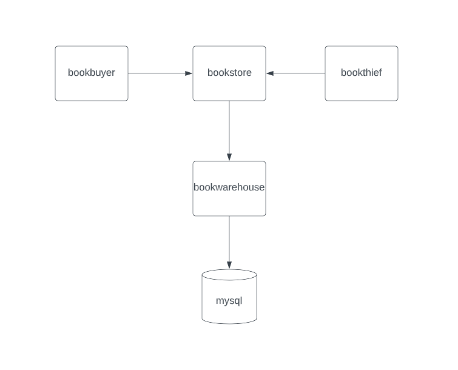
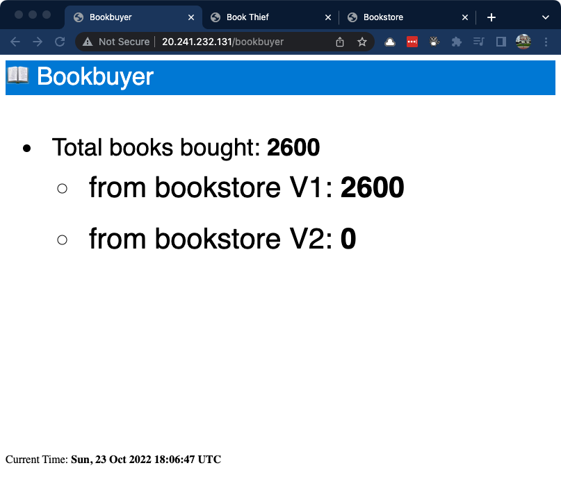
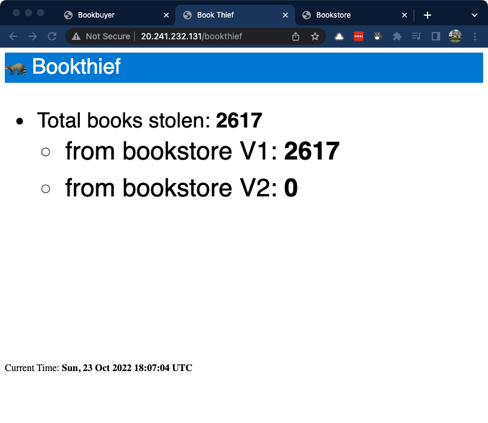
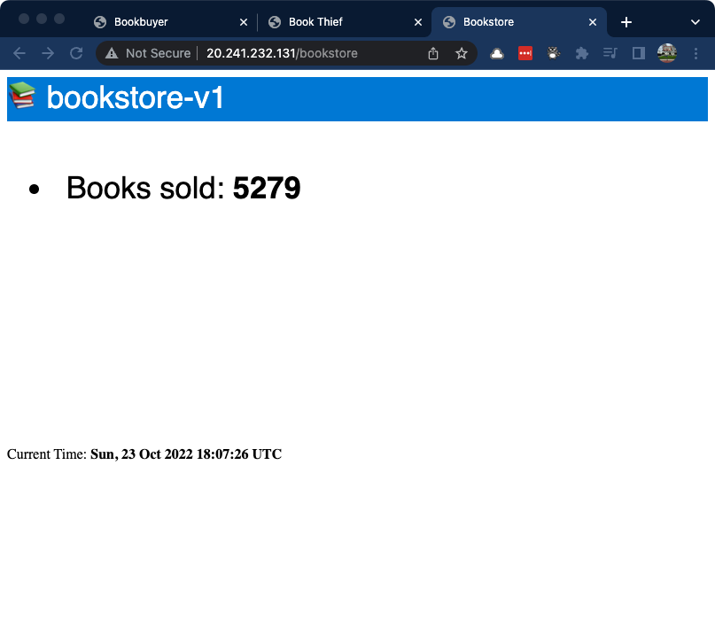

# Part 2: Bookstore application deployment

With an AKS cluster deployed, let's focus on deploying an application and configuring it to work with OSM and NGINX ingress.

The sample app deployed here is the same application demonstrated in [OSM's Getting Started guide](https://release-v1-2.docs.openservicemesh.io/docs/getting_started/install_apps/). The getting started guide uses [port-forwarding for exposing the application](https://release-v1-2.docs.openservicemesh.io/docs/getting_started/install_apps/#view-the-application-uis), but we'll use the managed NGINX ingress controller instead. We'll also need to deploy OSM `IngressBackend` configurations to route NGINX-managed ingress traffic to OSM-managed service backends.

## Application overview

Here is a simple diagram of the application pods that will be deployed into the cluster.



The `mysql` database pod is where book transactions are recorded. The `bookwarehouse` pod is responsible for reading/writing data to the database and should only be reachable from the `bookstore` pod. The `bookbuyer` and `bookthief` pods act as clients of the `bookstore` app. As the names suggest, one buys books from the bookstore while the other steals books.

The intent of this part of the lab is to just get the application up an running and demonstrate a working service mesh in permissive mode (the default).

Please ensure you have completed the steps in [Part 1](../README.md) before you proceed.

Make sure you are in the correct working directory.

```bash
cd 02-deploying-bookstore-app
```

## Deploy the namespaces to Kubernetes

As mentioned in Part 1, you need to add namespaces to OSM so that it can start managing traffic for them.

Run the following commands to create the application namespaces.

```bash
kubectl create namespace bookstore
kubectl create namespace bookbuyer
kubectl create namespace bookthief
kubectl create namespace bookwarehouse
```

Onboard the applications to OSM by adding the namespaces to OSM.

```bash
osm namespace add bookstore bookbuyer bookthief bookwarehouse
```

You should see output similar to the following:

```text
Namespace [bookstore] successfully added to mesh [osm]
Namespace [bookbuyer] successfully added to mesh [osm]
Namespace [bookthief] successfully added to mesh [osm]
Namespace [bookwarehouse] successfully added to mesh [osm]
```

Let's take a look at the labels that have been added to these namespaces.

```bash
kubectl get namespace -A --show-labels | grep book
```

The namespaces have also been annotated by OSM with to specify whether or not the control plane should be injecting data plane side cars into pods. You can see the annotation for each with these commands.

```bash
kubectl get namespace bookstore -o jsonpath='{.metadata.annotations}'
kubectl get namespace bookbuyer -o jsonpath='{.metadata.annotations}'
kubectl get namespace bookthief -o jsonpath='{.metadata.annotations}'
kubectl get namespace bookwarehouse -o jsonpath='{.metadata.annotations}'
```

You can also verify using the OSM CLI.

```bash
osm namespace list
```

## Deploy the application to Kubernetes

The deployment manifests are hosted in [OSM's docs repo](https://github.com/openservicemesh/osm-docs/tree/main/manifests/apps), so we can deploy them directly from there.

Run the following commands to deploy the applications.

```bash
kubectl apply -f https://raw.githubusercontent.com/openservicemesh/osm-docs/release-v1.2/manifests/apps/bookbuyer.yaml
kubectl apply -f https://raw.githubusercontent.com/openservicemesh/osm-docs/release-v1.2/manifests/apps/bookthief.yaml
kubectl apply -f https://raw.githubusercontent.com/openservicemesh/osm-docs/release-v1.2/manifests/apps/bookstore.yaml
kubectl apply -f https://raw.githubusercontent.com/openservicemesh/osm-docs/release-v1.2/manifests/apps/bookwarehouse.yaml
kubectl apply -f https://raw.githubusercontent.com/openservicemesh/osm-docs/release-v1.2/manifests/apps/mysql.yaml
```

## Exploring the `bookbuyer` pod and viewing `osm` configuration

Check on the `bookbuyer` pods

```bash
kubectl get pod -n bookbuyer
```

You should see an output similar to this:

```text
NAME                         READY   STATUS    RESTARTS   AGE
bookbuyer-6c759555b8-n4m7c   2/2     Running   0          112s
```

Do you notice the `READY` column reporting `2/2`? This means OSM sidecar injector has done its job. If you inspect the `bookbuyer` pod, you will see some event logs that indicate OSM was in there initializing itself and injecting the Envoy Proxy sidecar.

```bash
kubectl describe pod -l app=bookbuyer -n bookbuyer
```

## Exposing the `bookbuyer`, `bookthief` and `bookstore` web applications

Let's make use of the NGINX ingress and expose the `bookbuyer`, `bookthief` and `bookstore` web applications so that we can connect to them from a web browser.

> These web applications are setup to auto-refresh with a running counter indicating how many books were purchased, stolen, and the version of bookstore that was running at the time of transaction.

Expose the `bookbuyer` app by deploying a service and ingress.

```bash
kubectl apply -f ./bookbuyer-ui.yaml
```

Check the status of the ingress with the following command:

```bash
kubectl get ingress -n bookbuyer
```

You should see output similar to this:

```text
NAME        CLASS                                HOSTS   ADDRESS        PORTS   AGE
bookbuyer   webapprouting.kubernetes.azure.com   *       4.236.214.31   80      51s
```

A public IP address has been assigned to the ingress; however, the site will not work yet. The `bookstore` namespace is participating in the service mesh, so an `IngressBackend` resource is required to allow HTTP communication between the ingress and the backend service.

Deploy the `IngressBackend` for `bookbuyer` with the following command:

```bash
kubectl apply -f ./bookbuyer-ui-ingressbackend.yaml
```

Check the status of the ingress backend:

```bash
kubectl get ingressbackend -n bookbuyer
```

You should see output similar to this:

```text
NAME        STATUS
bookbuyer   committed
```

> Once you see a `STATUS` of `committed`, your application should be accessible to the internet.

Repeat the steps above for `bookthief` and `bookstore` apps.

```bash
kubectl apply -f ./bookthief-ui.yaml
kubectl apply -f ./bookstore-ui.yaml
kubectl apply -f ./bookthief-ui-ingressbackend.yaml
kubectl apply -f ./bookstore-ui-ingressbackend.yaml
```

Run the following command again to view the status of the `IngressBackends`.

```bash
kubectl get ingressbackend -A
```

You should see output similar to this:

```text
NAMESPACE   NAME        STATUS
bookbuyer   bookbuyer   committed
bookstore   bookstore   committed
bookthief   bookthief   committed
```

Now you should be able to access all of the sites. Issue the commands below and click each link to open the site in a web browser.

```bash
nginx_ingress_host="$(kubectl -n app-routing-system get service nginx -o jsonpath='{.status.loadBalancer.ingress[0].ip}')"

# these are the urls you should open in your browser
echo http://$nginx_ingress_host/bookbuyer
echo http://$nginx_ingress_host/bookthief
echo http://$nginx_ingress_host/bookstore
```

You should see each application auto-incrementing its sales, thefts, and books sold counters.

### Bookbuyer



### Bookthief



### Bookstore v1



## Next steps

We've successfully deployed the `bookbuyer`, `bookthief`, and `bookstore` applications and exposed their frontend UIs via ingress and configured OSM to allow traffic between the ingress endpoints and backend services. By default, OSM is configured in permissive traffic policy mode and we've enabled traffic to flow between ingress and backend service pods.

Now, head over to [Part 3: Applying Zero-Trust to the Bookstore application](../03-applying-zero-trust/README.md) to apply some Zero-Trust principles!

## Resources

* [Bookstore Sample Application][osm_bookstore_sample]
* [OSM and NGINX Ingress Controller Configuration][osm_nginx_ing]
* [OSM Permissive Traffic Policy][osm_permissive_traffic_policy]
* [Kubernetes: Service][k8s_svc]
* [Kubernetes: Ingress][k8s_ing]

<!-- RESOURCE_URLS -->
[osm_bookstore_sample]:https://release-v1-2.docs.openservicemesh.io/docs/getting_started/install_apps/
[osm_nginx_ing]:https://release-v1-2.docs.openservicemesh.io/docs/demos/ingress_k8s_nginx/
[osm_permissive_traffic_policy]:https://release-v1-2.docs.openservicemesh.io/docs/guides/traffic_management/permissive_mode/
[k8s_svc]:https://kubernetes.io/docs/concepts/services-networking/service/
[k8s_ing]:https://kubernetes.io/docs/concepts/services-networking/ingress/
