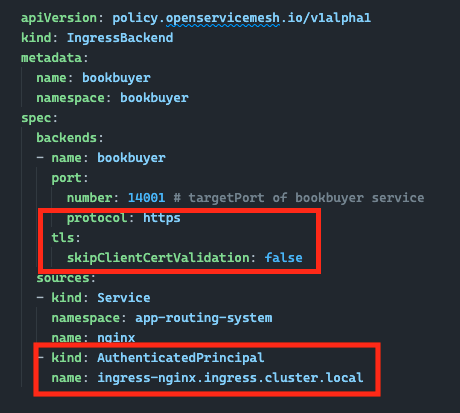

# Part 3: Applying Zero-Trust to the Bookstore application

So far we've deployed and exposed the Bookstore app via managed NGINX ingress controller and onboarded the Bookstore namespaces to OSM. Communication between pods within the service mesh is wide-open with the **permissive traffic policy** enabled and books are being stolen by the `bookthief` app. We need to lock things down and ensure `bookthief` is no longer able to communicate with `bookstore` and steal any more books. We'll also ensure we have end-to-end encryption in place for internal communication between the ingress and backend services using mutual TLS (mTLS).

Please ensure you have completed the steps in [Part 2: Bookstore application deployment](../02-deploying-bookstore-app/README.md) before you proceed.

Make sure you are in the right working directory (this command assumes you are currently in the `cloud-native/aks-open-service-mesh/02-deploying-bookstore-app/` directory).

```bash
cd ../03-applying-zero-trust
```

## Securing communications between ingress and backend services

We'll start by enforcing mTLS between the NGINX ingress controller. In order to secure communications between our managed ingress controller and OSM, we'll need to update the `Ingress` manifests to include NGINX controller-specific [`annotations`][nginx_annotations] and update our [`IngressBackend`][osm_ingressbackend_api] manifest to enforce HTTPS traffic using TLS certificates which have been created by OSM.

### Updating `Ingress` manifests

To secure communications, NGINX it will need to present a certificate to OSM. The following NGINX-specific `annotations` need to be added to the `Ingress` manifests:

* [`nginx.ingress.kubernetes.io/backend-protocol`][nginx_annotations_backend_protocol] tells NGINX how to communicate with the backend service. In our case, this will be set to `HTTPS`
* [`nginx.ingress.kubernetes.io/configuration-snippet`][nginx_annotations_configuration_snippet] to pass in additional configuration information for OSM. In our case, this will be set to `proxy_ssl_name "bookbuyer.bookbuyer.cluster.local";`
* [`nginx.ingress.kubernetes.io/proxy-ssl-secret`][nginx_annotations_proxy_ssl_secret] is the secret name formatted as `namespace/secretName` where the client certificate is stored. This certificate is used by NGINX to proxy HTTPS connects to TLS backends. In our case, this will be set to `kube-system/osm-ingress-client-cert`
* [`nginx.ingress.kubernetes.io/proxy-ssl-verify`][nginx_annotations_proxy_ssl_verify] enables or disables verification of proxied HTTPS server certificate. In our case, this will be set to `on`

Typically you would need to manually [edit the OSM `meshconfig` resource](https://release-v1-2.docs.openservicemesh.io/docs/demos/ingress_k8s_nginx/#https-ingress-mtls-and-tls) so that OSM can issue and store certificates within a [Kubernetes secret][k8s_secret]. With managed-OSM, this configuration is done for you.

To retrieve the details of the certificate for ingress gateway, you can run the following command:

```bash
kubectl get meshconfig osm-mesh-config -n kube-system -o yaml
```

In the output, you should see `certificate` details. Here is the snippet of code you should look for.

```yaml
...
certificate:
  certKeyBitSize: 2048
  ingressGateway:
    secret:
      name: osm-ingress-client-cert
      namespace: kube-system
    subjectAltNames:
    - ingress-nginx.ingress.cluster.local
    validityDuration: 24h
  serviceCertValidityDuration: 24h
...
```

The truncated output above lists the certificate details which will be used by the ingress; it includes the secret's `name`, `namespace`, and the `subjectAltNames` (SAN) of the TLS certificate.

### Updating `IngressBackend` manifests

We'll need to update the `IngressBackend` manifests using the certificate information listed above.

First, we need to update the [`IngressBackendSpec`][osm_ingressbackendspec] and change the `PortSpec` from `http` to `https`. Then we'll need to add a `TLSSpec` element and set the `skipClientCertValidation` to `false`.

From there, we need to update the [`IngressSourceSpec`][osm_ingresssourcespec] and add a new source with the `kind` attribute being set to `AuthenticatedPrincipal` and set the `name` attribute to `ingress-nginx.ingress.cluster.local`. This tells OSM to expect traffic from the NGINX ingress controller.

OSM provisioned a client certificate for the NGINX ingress service with the Subject ALternative Name (SAN) `ingress-nginx.ingress.cluster.local`, so the `IngressBackend` configuration needs to reference the same SAN for mTLS authentication (between the Nginx ingress service and the backend services).

The name of the `subjectAltNames` object can also be pulled from the OSM `meshconfig` resource. You can view it with the following command.

```bash
kubectl get meshconfig osm-mesh-config -n kube-system -o jsonpath='{.spec.certificate.ingressGateway}' | jq -r .subjectAltNames | jq -r '.[0]'
```

Here is an example of what the new `IngressBackend` looks like for the `bookbuyer` app:



### Apply the updated ingress configurations

The `Ingress` and `IngressBackend` manifests have been updated for you so you can simply apply the configuration to lock down the ingress to backend service traffic with OSM.

Let's re-deploy `Ingress` and `IngressBackend` resources for `bookbuyer`, `bookthief`, and `bookstore` using the following commands.

```bash
kubectl apply -f bookbuyer-ui-secure-ingress.yaml
kubectl apply -f bookthief-ui-secure-ingress.yaml
kubectl apply -f bookstore-ui-secure-ingress.yaml
```

> Whenever changes are made to Ingress resources, IngressBackend resources are re-synced.

Confirm the `IngressBackend` statuses show as "committed".

```bash
kubectl get ingressbackend -A
```

If you still have your apps open in a browser, you might need to refresh the pages to confirm the app is still running.

If you need the site URLs again, run the following commands:

```bash
nginx_ingress_host="$(kubectl -n app-routing-system get service nginx -o jsonpath='{.status.loadBalancer.ingress[0].ip}')"

# these are the urls you should open in your browser
echo http://$nginx_ingress_host/bookbuyer
echo http://$nginx_ingress_host/bookthief
echo http://$nginx_ingress_host/bookstore
```

## Configure SMI traffic policies

OSM is running in permissive mode, which means all resources enrolled in the mesh can talk freely with each other. One of the main reasons why you would want to implement a service mesh is to enforce end-to-end encryption of network communications. This is one of the key features of OSM and you can enabled it using [SMI traffic policies][osm_smi_traffic_policy].

### Disable permissive traffic policies

Run this command to disable permissive traffic policy mode.

```bash
kubectl patch meshconfig osm-mesh-config -n kube-system -p '{"spec":{"traffic":{"enablePermissiveTrafficPolicyMode":false}}}'  --type=merge
```

### Enable SMI traffic policies

With the permissive traffic policy mode disabled, the application pods can no longer communicate with each other. If you have the **bookbuyer**, **bookthief**, and **bookstore** applications still open in your web browser, you will see the counters have stopped incrementing.

Communication within the service mesh has gone from default allow, to default deny. OSM now requires [SMI access control policies][osm_smi_access_control_policy] (e.g., `TrafficTarget`, `HTTPRouteGroup`, and `TCPRoute` CRDs) to enable traffic flow.

Here's an overview of each resource:

**[`TrafficTarget`][smi_traffictarget]**: Used to associate a set of traffic definitions (rules) with a service identity. Access control is based on [service identity][k8s_serviceaccount] which can be allocated to groups of pods.

**[`HTTPRouteGroup`][smi_httproutegroup]**: Describes the HTTP/1 and HTTP/2 traffic characteristics to filter on in `TrafficTarget` rule definitions. Filters can be applied to combinations of HTTP headers, paths using Regex, and methods.

**[`TCPRoute`][smi_tcproute]**: Describes the L4 TCP traffic to filter on in `TrafficTarget` rule definitions.

**[`UDPRoute`][smi_udproute]**: Describes the L4 UDP traffic to filter on in `TrafficTarget` rule definitions.

Using the `HTTPRouteGroup` resource, we can define a traffic filter for GET requests that are made to the `/books-bought` path with specific header information like this.

```yml
apiVersion: specs.smi-spec.io/v1alpha4
kind: HTTPRouteGroup
metadata:
  name: bookstore-service-routes
  namespace: bookstore
spec:
  matches:
  - name: books-bought
    pathRegex: /books-bought
    methods:
    - GET
    headers:
    - "user-agent": ".*-http-client/*.*"
    - "client-app": "bookbuyer"
  - name: buy-a-book
    pathRegex: ".*a-book.*new"
    methods:
    - GET
```

The manifest above will filter network requests and can be used to define rules for allowing traffic flow. Using the `TrafficTarget` resource, we can apply the filter to specific source/destination pairs.

```yml
kind: TrafficTarget
apiVersion: access.smi-spec.io/v1alpha3
metadata:
  name: bookstore
  namespace: bookstore
spec:
  destination:
    kind: ServiceAccount
    name: bookstore
    namespace: bookstore
  rules:
  - kind: HTTPRouteGroup
    name: bookstore-service-routes
    matches:
    - buy-a-book
    - books-bought
  sources:
  - kind: ServiceAccount
    name: bookbuyer
    namespace: bookbuyer
```

The manifest above will create a new access policy that filters traffic based on the `HTTPRouteGroup` named `bookstore-service-routes` and allow pods that are running as the `bookbuyer` service account to communicate with pods running as the `bookstore` service account.

> Note that OSM uses `ServiceAccounts` to identify groups of resources.

Run the command below to deploy the SMI traffic access policies.

```bash
kubectl apply -f smi-traffic-to-mysql.yaml
kubectl apply -f smi-traffic-to-bookwarehouse.yaml
kubectl apply -f smi-traffic-to-bookstore.yaml
```

Now if you re-visit the **bookbuyer** and **bookstore** web applications, you'll see the counters are incrementing again. However, the **bookthief** application was not given access to communicate to **bookstore** and therefore, the counter remains idle.

## Next steps

Congratulations, you have successfully blocked the **bookthief** application from stealing books 🎉

Now, head over to [Part 4: Traffic splitting with OSM](../04-osm-traffic-splitting/README.md) where we'll deploy a new version of the **bookstore** app and take a canary approach to release **bookstore v2**.

## Resources

* [IngressBackend API][osm_ingressbackend_api]
* [Traffic Access Control][smi_traffictarget]
* [Traffic Specs][smi_trafficspecs]
* [NGINX Ingress Controller Annotations][nginx_annotations]

<!-- RESOURCE_URLS -->
[osm_smi_traffic_policy]:https://release-v1-2.docs.openservicemesh.io/docs/getting_started/traffic_policies/#smi-traffic-policy-mode
[osm_smi_access_control_policy]:https://release-v1-2.docs.openservicemesh.io/docs/getting_started/traffic_policies/#deploy-smi-access-control-policies
[osm_ingressbackend_api]:https://release-v1-2.docs.openservicemesh.io/docs/guides/traffic_management/ingress
[osm_ingressbackendspec]:https://release-v1-2.docs.openservicemesh.io/docs/api_reference/policy/v1alpha1/#policy.openservicemesh.io/v1alpha1.BackendSpec
[osm_ingresssourcespec]:https://release-v1-2.docs.openservicemesh.io/docs/api_reference/policy/v1alpha1/#policy.openservicemesh.io/v1alpha1.IngressSourceSpec
[smi_trafficspecs]:https://github.com/servicemeshinterface/smi-spec/blob/v0.6.0/apis/traffic-specs/v1alpha4/traffic-specs.md
[smi_traffictarget]:https://github.com/servicemeshinterface/smi-spec/blob/v0.6.0/apis/traffic-access/v1alpha2/traffic-access.md#traffictarget
[smi_httproutegroup]:https://github.com/servicemeshinterface/smi-spec/blob/v0.6.0/apis/traffic-specs/v1alpha4/traffic-specs.md#httproutegroup
[smi_tcproute]:https://github.com/servicemeshinterface/smi-spec/blob/v0.6.0/apis/traffic-specs/v1alpha4/traffic-specs.md#tcproute
[smi_udproute]:https://github.com/servicemeshinterface/smi-spec/blob/v0.6.0/apis/traffic-specs/v1alpha4/traffic-specs.md#udproute
[nginx_annotations]:https://kubernetes.github.io/ingress-nginx/user-guide/nginx-configuration/annotations
[nginx_annotations_backend_protocol]:https://kubernetes.github.io/ingress-nginx/user-guide/nginx-configuration/annotations/#backend-protocol
[nginx_annotations_configuration_snippet]:https://kubernetes.github.io/ingress-nginx/user-guide/nginx-configuration/annotations/#configuration-snippet
[nginx_annotations_proxy_ssl_secret]:https://kubernetes.github.io/ingress-nginx/user-guide/nginx-configuration/annotations/#backend-certificate-authentication
[nginx_annotations_proxy_ssl_verify]:https://kubernetes.github.io/ingress-nginx/user-guide/nginx-configuration/annotations/#backend-certificate-authentication
[k8s_secret]:https://kubernetes.io/docs/concepts/configuration/secret
[k8s_serviceaccount]:https://kubernetes.io/docs/tasks/configure-pod-container/configure-service-account
