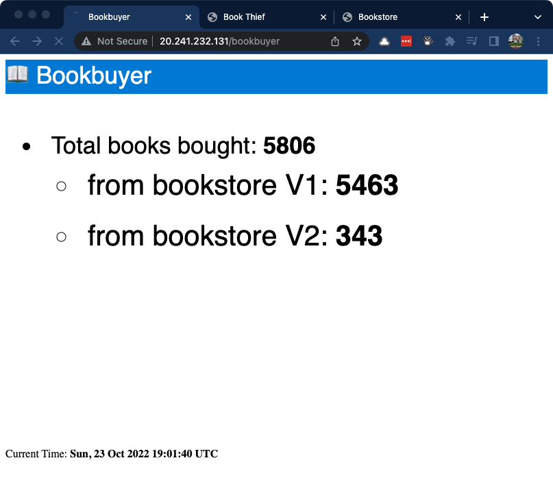
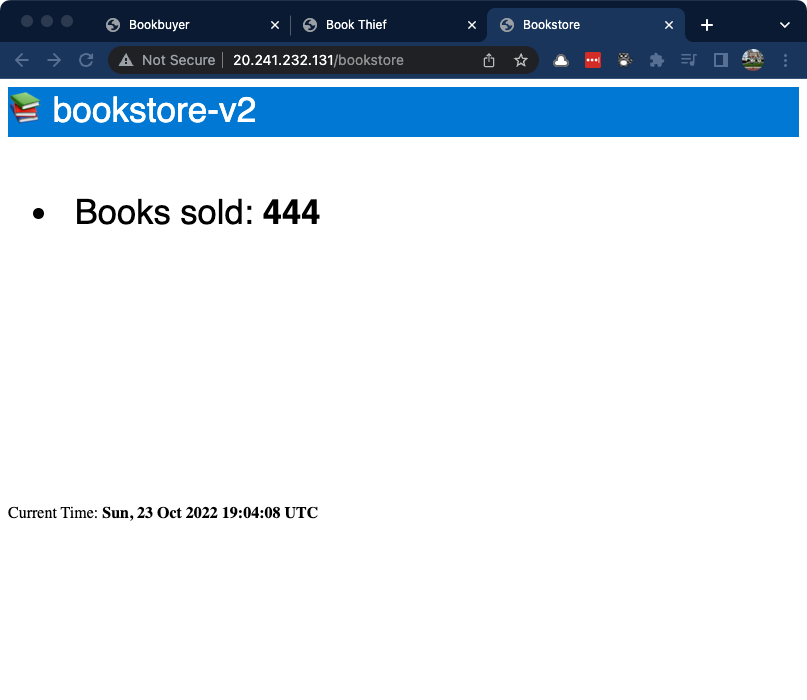

# Part 4: Traffic splitting with OSM

Another core component of OSM is [traffic splitting][osm_traffic_splitting] which allows you to implement a/b testing, blue-green deployment, or canary deployment practices. 

Please ensure you have completed the steps in [Part 3: Applying Zero-Trust to the Bookstore application](../03-applying-zero-trust/README.md) before you proceed.

Make sure you are in the right working directory:

```bash
# this command assumes are you currently in the 03-applying-zero-trust directory
cd ../04-osm-traffic-splitting
```

Run this command to deploy a new version of bookstore (`bookstore-v2`):

```bash
kubectl apply -f https://raw.githubusercontent.com/openservicemesh/osm-docs/release-v1.2/manifests/apps/bookstore-v2.yaml
```

Inspect the resources within `bookstore` namespace to see what is new.

```bash
kubectl get all -n bookstore
```

You should see output similar to the following:

```text
NAME                                READY   STATUS    RESTARTS   AGE
pod/bookstore-97956675d-dfrlq       2/2     Running   0          84m
pod/bookstore-v2-6ccc9b8746-cqxn6   2/2     Running   0          45s

NAME                   TYPE        CLUSTER-IP     EXTERNAL-IP   PORT(S)     AGE
service/bookstore      ClusterIP   10.0.132.170   <none>        14001/TCP   84m
service/bookstore-v1   ClusterIP   10.0.181.65    <none>        14001/TCP   84m
service/bookstore-v2   ClusterIP   10.0.117.98    <none>        14001/TCP   46s

NAME                           READY   UP-TO-DATE   AVAILABLE   AGE
deployment.apps/bookstore      1/1     1            1           84m
deployment.apps/bookstore-v2   1/1     1            1           45s

NAME                                      DESIRED   CURRENT   READY   AGE
replicaset.apps/bookstore-97956675d       1         1         1       84m
replicaset.apps/bookstore-v2-6ccc9b8746   1         1         1       45s
```

With the new version of `bookstore` running, we can use the `TrafficSplit` CRD to split traffic evenly between `bookstore-v1` and `bookstore-v2` backend services.

```yml
apiVersion: split.smi-spec.io/v1alpha2
kind: TrafficSplit
metadata:
  name: bookstore-split
  namespace: bookstore
spec:
  service: bookstore.bookstore # <root-service>.<namespace>
  backends:
  - service: bookstore-v1 # matches app:bookstore,version:v1
    weight: 50
  - service: bookstore-v2 # matches app:bookstore,version:v2
    weight: 50
```

Run the following command to evenly split the traffic:

```bash
kubectl apply -f https://raw.githubusercontent.com/openservicemesh/osm-docs/release-v1.2/manifests/split/traffic-split-50-50.yaml
```

If you take a look at our **bookbuyer** web page again, you will see both versions of the **bookstore** are selling books.

> If you do not have the **bookbuyer** app, run the following commands to retrieve the URL and open in a web browser

```bash
nginx_ingress_host="$(kubectl -n app-routing-system get service nginx -o jsonpath='{.status.loadBalancer.ingress[0].ip}')"

# these are the urls you should open in your browser
echo http://$nginx_ingress_host/bookbuyer
echo http://$nginx_ingress_host/bookthief
echo http://$nginx_ingress_host/bookstore
```



After a bit of testing you are now ready to cutover all traffic from v1 to v2. Run the following command up distribute 100% of the traffic to v2.

```bash
kubectl apply -f https://raw.githubusercontent.com/openservicemesh/osm-docs/release-v1.2/manifests/split/traffic-split-v2.yaml
```

If you take a look at our **bookbuyer** web page again, we can see only **bookstore-v2** is selling books.

With **bookstore-v1** no longer taking any requests, lets redeploy the `service`, `ingress`, and `ingressbackend` and point them all to **bookstore-v2**.

```bash
kubectl apply -f bookstore-ui-v2.yaml
```

Navigate back to the **bookstore** app in your web browser and you will now see `bookstore-v2` with an incrementing counter.

> You might need to refresh the **bookstore** app.



## Wrap up and next steps

In this multi-part lab, we deployed an AKS cluster with Bicep and enabled the Web Application Routing and Open Service Mesh add-ons. These open-source components can be installed in your cluster manually; however, when you enable them as add-ons, they are managed by the Azure platform and are fully supported. 

There's more to OSM than what we explored in this lab. We only controlled traffic from an ingress perspective but with OSM, you can also control [egress traffic][osm_egress]. You can also implement patterns and practices to help with application resiliency using techniques like [rate limiting][osm_rate_limiting], [retry][osm_retry], and [circuit breakers][osm_circuit_breaker]. I encourage you to visit the links in the resources section below to learn and implement more.

Once you have finished exploring, you should delete the deployment to avoid any further charges.

```bash
az group delete --name rg-${name} -y
```

If you thought this was helpful, please give the repo a ⭐️ or let us know of any questions of feedback by filing a [new issue](https://github.com/Azure-Samples/azure-opensource-labs/issues/new).

Cheers!

## Resources

* [Traffic Splitting][osm_traffic_splitting]
* [Canary Rollouts using SMI Traffic Split][osm_canary_rollouts]
* [Rate Limiting][osm_rate_limiting]
* [Retry][osm_retry]
* [Circuit Breaking][osm_circuit_breaker]

<!-- RESOURCE_URLS -->
[osm_traffic_splitting]:https://release-v1-2.docs.openservicemesh.io/docs/guides/traffic_management/traffic_split
[osm_canary_rollouts]:https://release-v1-2.docs.openservicemesh.io/docs/demos/canary_rollout
[osm_egress]:https://release-v1-2.docs.openservicemesh.io/docs/guides/traffic_management/egress/
[osm_circuit_breaker]:https://release-v1-2.docs.openservicemesh.io/docs/guides/traffic_management/circuit_breaking/
[osm_retry]:https://release-v1-2.docs.openservicemesh.io/docs/guides/traffic_management/retry_policy/
[osm_rate_limiting]:https://release-v1-2.docs.openservicemesh.io/docs/guides/traffic_management/rate_limiting/