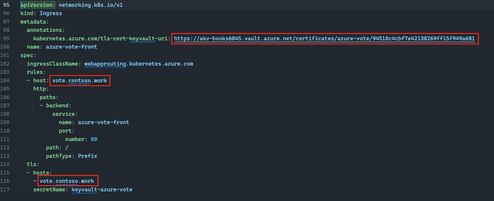
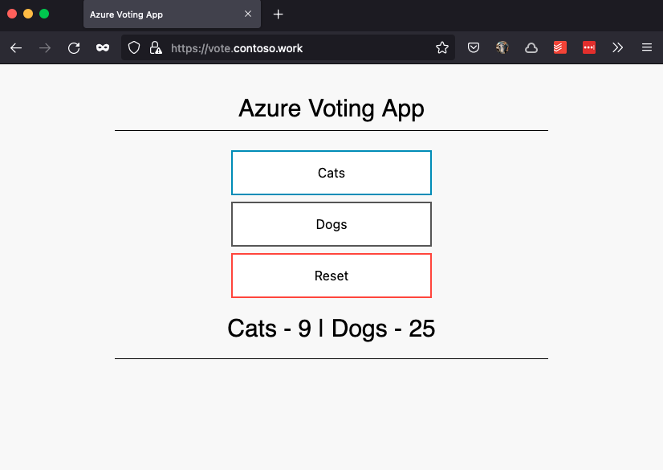

# Web Application Routing with Azure Kubernetes Service

In this lab, you will deploy an [AKS][aks] cluster and enable the [Web Application Routing (Preview)][aks_addon_web_app_routing] add-on. This add-on deploys a fully-managed Open-Source NGINX ingress controller into your cluster. We will explore the components that get installed then deploy and expose the [Azure Voting App](https://github.com/pauldotyu/azure-voting-app).

## Requirements

Before you get started, make sure you have the following:

* An Azure Subscription (e.g. [Free](https://aka.ms/azure-free-account) or [Student](https://aka.ms/azure-student-account) account)
* The [Azure CLI](https://docs.microsoft.com/cli/azure/install-azure-cli) with [Azure Bicep](https://learn.microsoft.com/azure/azure-resource-manager/bicep/install#azure-cli) installed
* The [Git CLI](https://git-scm.com/book/en/v2/Getting-Started-Installing-Git)
* The [`kubectl` CLI](https://kubernetes.io/docs/tasks/tools/install-kubectl-linux/)
* Bash shell (e.g. macOS, Linux, [Windows Subsystem for Linux (WSL)](https://docs.microsoft.com/windows/wsl/about), [Multipass](https://multipass.run/), [Azure Cloud Shell](https://docs.microsoft.com/azure/cloud-shell/quickstart), [GitHub Codespaces](https://github.com/features/codespaces), etc)
* Domain registered through a [ICANN-Accredited Registrar](https://www.icann.org/registrar-reports/accredited-list.html)

> **IMPORTANT**
>
> You will need to [delegate your DNS zone with Azure DNS](https://learn.microsoft.com/azure/dns/dns-domain-delegation) for the **Web App Routing** and **Azure DNS** integration to work properly. See this [link](https://learn.microsoft.com/azure/dns/dns-delegate-domain-azure-dns) for more info.

Make sure you have all requisite providers registered and the `aks-preview` extension installed:

```bash
# install provider for aks
az provider register --namespace Microsoft.ContainerService
# install aks-preview extension
az extension add --name aks-preview
```

## Deploy Azure Resources

Clone this repo and drop into the `aks-webapp-routing` directory.

```bash
git clone https://github.com/Azure-Samples/azure-opensource-labs.git
cd azure-opensource-labs/cloud-native/aks-webapp-routing
```

Open a terminal and initialize the following variables which will be passed into the deployment.

```bash
# azure region where resources will be deployed to
location=eastus

# random name that will be used for azure resources
name=vote$RANDOM

# get the latest (n-1) version of kubernetes
kubernetesVersion=$(az aks get-versions -l $location -o table | head -4 | tail -n 1 | cut -f 1 -d ' ')

# kubernetes node count
systemNodeCount=3

# azure vm size for nodes
systemNodeSize=Standard_D4ds_v5

# get your user name
userName=$(az account show --query user.name -o tsv)

# get your user principal id
userObjectId=$(az ad user show --id $userName --query id -o tsv)

# a domain name you wish to use with the web_app_routing add-on
dnsName=contoso.work
```

Deploy Azure infrastructure with the Azure Bicep template.

```bash
az deployment sub create \
  --name "$name-deploy" \
  --location $location \
  --template-file ./main.bicep \
  --parameters name=$name \
               location=$location \
               kubernetesVersion=$kubernetesVersion \
               systemNodeCount=$systemNodeCount \
               systemNodeSize=$systemNodeSize \
               userObjectId=$userObjectId \
               dnsName=$dnsName
```

> The deployment should take ~11 mins to complete

The template will deploy the following resources into your subscription:

* [Azure Resource Group][rg] to deploy resources into
* [Azure Kubernetes Service][aks] your managed Kubernetes cluster with [`kubenet`][kubenet] as the container network plugin and [`calico`][calico] for network policy and include the following [AKS add-ons][aks_addons]
  * [`monitoring`](https://learn.microsoft.com/azure/azure-monitor/containers/container-insights-overview)
  * [`azure-keyvault-secrets-provider`](https://learn.microsoft.com/azure/aks/csi-secrets-store-driver)
  * [`web_application_routing`](https://learn.microsoft.com/azure/aks/web-app-routing?tabs=without-osm)
* [Azure Key Vault][kv] to store your TLS certificates
* [Azure DNS][dns] will be integrated with the `web_application_routing` add-on and manage your domain names

> If you are curious to know how these Bicep modules are deployed to Azure Container Registry, take a look at this [blog post](https://dev.to/azure/sharing-bicep-modules-with-azure-container-registry-4mo0).

## Validate the Azure deployment

View a list of resources deployed in your resource group by running the following command or view from the [Azure Portal](https://portal.azure.com):

```bash
az resource list --resource-group rg-$name -o table
```

To view the AKS add-ons that have been installed, run the command below:

```bash
az aks show --resource-group rg-${name} --name aks-${name} --query addonProfiles
```

You'll notice that the AKS `web_app_routing` add-on is not included in the `addonProfiles` result. The metadata for this add-on is actually kept in the `ingressProfile` object. Run the command below to view the `web_app_routing` configuration:

```bash
az aks show --resource-group rg-${name} --name aks-${name} --query ingressProfile
```

One last step to complete the `web_app_routing` integration with Azure DNS. We need to grant the user assigned managed identity resource the proper permissions to manage record sets for the DNS zone. Run the following commands to grant access.

```bash
# Retrieve user managed identity object ID for the add-on
SUBSCRIPTION_ID=$(az account show --query id --output tsv)
MANAGEDIDENTITYNAME="webapprouting-aks-${name}"
MCRGNAME=$(az aks show -g rg-${name} -n aks-${name} --query nodeResourceGroup -o tsv)
USERMANAGEDIDENTITY_RESOURCEID="/subscriptions/${SUBSCRIPTION_ID}/resourceGroups/${MCRGNAME}/providers/Microsoft.ManagedIdentity/userAssignedIdentities/${MANAGEDIDENTITYNAME}"
MANAGEDIDENTITY_OBJECTID=$(az resource show --id $USERMANAGEDIDENTITY_RESOURCEID --query properties.principalId -o tsv | tr -d '[:space:]')
# Configure the add-on to use Azure DNS to manage creating DNS zones
ZONEID=$(az network dns zone show -g rg-${name} -n $dnsName --query id --output tsv)
az role assignment create --role "DNS Zone Contributor" --assignee $MANAGEDIDENTITY_OBJECTID --scope $ZONEID
```

## Delegate DNS to Azure DNS

Now is a good time to log into your domain name registrar's management portal and [delegate your DNS zone to Azure DNS](https://learn.microsoft.com/azure/dns/dns-delegate-domain-azure-dns#delegate-the-domain).

Run this command to view the nameservers for your DNS zone in Azure DNS:

```bash
az network dns record-set list -g rg-${name} -z $dnsName --query "[0].nsRecords[].nsdname"
```

> **NOTE**
>
> Azure will return nameservers that end with a dot (.). Some DNS registrars like GoDaddy will not accept the dot at the end so you will need to omit it.

If you do not have a domain registered with an [ICANN-Accredited Registrar](https://www.icann.org/registrar-reports/accredited-list.html), you can still continue the lab. Your website will not be routable over the public internet but you can use host file entries to manually point to a public IP.

## Validate access to the Kubernetes cluster

Before we pull down credentials from AKS make sure you have `kubectl` CLI locally.

> If you do not have `kubectl` installed yet, you can run the following command to install it using Azure CLI command: `az aks install-cli`

Run the following command to download credential for `kubectl` CLI:

```bash
az aks get-credentials --resource-group rg-${name} --name aks-${name}
```

Run the following command to see the namespaces that are installed so far:

```bash
kubectl get namespaces
```

You should see an output similar to this:

```output
NAME                 STATUS   AGE
app-routing-system   Active   16m
calico-system        Active   25m
default              Active   25m
kube-node-lease      Active   25m
kube-public          Active   25m
kube-system          Active   25m
tigera-operator      Active   25m
```

The `web_application_routing` add-on deploys a managed [OSS NGINX controller](https://kubernetes.github.io/ingress-nginx/). Check all the resources that it installed in the cluster with the following command:

```bash
kubectl get all --namespace app-routing-system
```

You should see output similar to this:

```output
NAME                                READY   STATUS    RESTARTS   AGE
pod/external-dns-7989f85cbb-jhmng   1/1     Running   0          19m
pod/nginx-687969b887-g48cf          1/1     Running   0          18m
pod/nginx-687969b887-qtjmp          1/1     Running   0          19m

NAME            TYPE           CLUSTER-IP    EXTERNAL-IP      PORT(S)                      AGE
service/nginx   LoadBalancer   10.0.102.60   20.120.120.189   80:30282/TCP,443:30079/TCP   19m

NAME                           READY   UP-TO-DATE   AVAILABLE   AGE
deployment.apps/external-dns   1/1     1            1           19m
deployment.apps/nginx          2/2     2            2           19m

NAME                                      DESIRED   CURRENT   READY   AGE
replicaset.apps/external-dns-7989f85cbb   1         1         1       19m
replicaset.apps/nginx-687969b887          2         2         2       19m

NAME                                        REFERENCE          TARGETS   MINPODS   MAXPODS   REPLICAS   AGE
horizontalpodautoscaler.autoscaling/nginx   Deployment/nginx   0%/90%    2         100       2          19m
```

> The OSS NGINX ingress controller can be [installed manually via Helm chart](https://learn.microsoft.com/en-us/azure/aks/ingress-basic?tabs=azure-cli#create-an-ingress-controller), but with this being a managed NGINX controller, the installation is taken care of for you 🎉

Inspect the NGINX deployment:

```bash
kubectl get deployment nginx --namespace app-routing-system --output yaml
```

One important thing to note is the ingress controller is deployed with an ingress class name of `webapprouting.kubernetes.azure.com`. We'll need this later in the lab as you configure your `Ingress` resources. If you run the following command, you will see the class name of the ingress controller:

```bash
kubectl get ingressclasses
```

You should see output similar to this:

```output
NAME                                 CONTROLLER             PARAMETERS   AGE
webapprouting.kubernetes.azure.com   k8s.io/ingress-nginx   <none>       21m
```

Optionally, inspect the managed NGINX controller pods that have been deployed:

```bash
# get the name of the first running pod in the list
pod=$(kubectl get po -n app-routing-system --no-headers=true | grep nginx | grep Running | head -1 | cut -f 1 -d ' ')
kubectl get po -n app-routing-system $pod -o yaml
```

### Wait... what is this `external-dns` deployment that I saw?

You may have noticed in the output above when you performed the `kubectl get all` command that there is a pod name that starts with `external-dns` and a deployment named `external-dns`. Run the following command to inspect its deployment details.

```bash
kubectl get deployment external-dns --namespace app-routing-system --output yaml
```

As the name suggests, this pod is responsible for managing DNS records in your Azure DNS zone which was provisioned as part of our Bicep deployment.

As part of our deployment process, we took the user-assigned managed identity that is created by the `web_application_routing` add-on deployment and granted it the **DNS Zone Contributor** role so that the pod can write entries for your zone. So this pod will essentially take care of writing DNS entries for you as you deploy `Ingress` resources to your cluster.

## Application Deployment

Make a copy of the [`deployment.yaml`](./deployment.yaml) file and name it `azure-vote-deployment.yaml`. We will need to update this manifest for our deployment.

### Create a self-signed certificate

When deploying an `Ingress` resource with a HTTPS-based hostname, you will need to include a SSL certificate. The `web_application_routing` add-on will be able to inject the certificate directly from Azure Key Vault.

If you have a valid certificate for your custom domain name, you are welcome to [upload that to Azure Key Vault](https://learn.microsoft.com/azure/key-vault/certificates/tutorial-import-certificate?tabs=azure-portal).

If you do not have a certificate for your custom domain name, we can create a self-signed certificate using the following commands:

```bash
# Create a self-signed SSL certificate
# NOTE: The <Hostname> can be a subdomain (e.g. vote.contoso.work)
openssl req -new -x509 -nodes -out aks-ingress-tls.crt -keyout aks-ingress-tls.key -subj "/CN=<Hostname>" -addext "subjectAltName=DNS:<Hostname>"

# Export the SSL certificate
# NOTE: You must skip the password prompt (i.e. leave it blank)
openssl pkcs12 -export -in aks-ingress-tls.crt -inkey aks-ingress-tls.key -out aks-ingress-tls.pfx
```

### Import the certificate to Azure Key Vault

```bash
az keyvault certificate import --vault-name akv-$name -n azure-vote -f aks-ingress-tls.pfx
```

The command above will output a large JSON object to the terminal. You will need the certificate URI for the next step. This value can be found in within the `id` attribute for the resource.

If you want to be sure you are retrieving the correct certificate URI, you can run the following command:

```bash
az keyvault certificate show --vault-name akv-$name -n azure-vote --query id --output tsv
```

Copy the value to your clipboard as you will need to add this to your deployment manifest.

### Update the `azure-vote-deployment.yaml` manifest

Open the `azure-vote-deployment.yaml` manifest using your favorite text editor, and replace the `<Hostname>` with your DNS zone name and the `<KeyVaultCertificateUri>` with certificate URI from Azure Key Vault.

Here is an example of what the new file should look like:



> `secretName` is the name of the secret that going to be generated to store the certificate. This is the certificate that's going to be presented in the browser.

### Deploy the `azure-vote-deployment.yaml` manifest

Run the following command to deploy the manifest

```bash
kubectl apply -f azure-vote-deployment.yaml
```

Confirm the deployment by running this command.

```bash
kubectl get ingress
```

After about a minute, you should see the `ADDRESS` column populated with a public IP address within a minute or two and the output will look similar to this:

```output
NAME               CLASS                                HOSTS               ADDRESS          PORTS     AGE
azure-vote-front   webapprouting.kubernetes.azure.com   vote.contoso.work   20.246.231.104   80, 443   45s
```

You can also check your DNS zone for updated A records that points to your ingress' IP using the following command:

```bash
az network dns record-set list -g rg-${name} -z $dnsName --query "[?type=='Microsoft.Network/dnszones/A']"
```

Your output will look similar to this:

```output
[
  {
    "aRecords": [
      {
        "ipv4Address": "20.246.231.104"
      }
    ],
    "aaaaRecords": null,
    "caaRecords": null,
    "cnameRecord": null,
    "etag": "xxxxxxxx-xxxx-xxxx-xxxx-xxxxxxxxxxxx",
    "fqdn": "vote.contoso.work.",
    "id": "/subscriptions/xxxxxxxx-xxxx-xxxx-xxxx-xxxxxxxxxxxx/resourceGroups/rg-vote24543/providers/Microsoft.Network/dnszones/contoso.work/A/hello",
    "metadata": null,
    "mxRecords": null,
    "name": "hello",
    "nsRecords": null,
    "provisioningState": "Succeeded",
    "ptrRecords": null,
    "resourceGroup": "rg-vote6045",
    "soaRecord": null,
    "srvRecords": null,
    "targetResource": {
      "id": null
    },
    "ttl": 300,
    "txtRecords": null,
    "type": "Microsoft.Network/dnszones/A"
  }
]
```

You can also view the `external-dns` pod logs to see it making changes to your DNS zone using the following command:

```bash
pod=$(kubectl get po -n app-routing-system --no-headers=true | grep external-dns | grep Running | head -1 | cut -f 1 -d ' ')
kubectl logs $pod -n app-routing-system
```

Finally, validate the deployment by opening a web browser and navigating to your custom domain name.

> If you have not [delegated your DNS zone to Azure DNS](https://learn.microsoft.com/azure/dns/dns-delegate-domain-azure-dns#delegate-the-domain) at your registrar's DNS management tool, you could setup an [entry in your local host file](https://www.howtogeek.com/howto/27350/beginner-geek-how-to-edit-your-hosts-file/) to point your custom domain to the public ingress IP.



> Some browsers may not let you view websites that are secured using self-signed certificates. In this case you may need to update your browser configuration.

## Wrap up

In lab, we deployed an AKS cluster using Bicep templates and enabled the Web Application Routing add-on. 

We then examined the resources that been deployed into our cluster and uncovered how the integrations work. This add-on includes integrations with Azure Key Vault and Azure DNS which enables you to easily expose applications to the internet. Using annotations on the NGINX ingress controller, we can simply bind the `Ingress` resource to a TLS certificate in Azure Key Vault to secure our website.

Also, with Azure DNS integrated with the add-on, we observed that it deployed an `external-dns` controller and we gave the add-on proper permissions to manipulate DNS records. As you expose additional sites (as subdomains) you will have additional DNS entries which should save you a bit of time.

Best part of the add-on is that it is a OSS component that is fully-managed and fully-supported by Microsoft 🥳

Once you have finished exploring, you should delete the deployment to avoid any further charges.

```bash
az group delete --name rg-${name} -y
```

## Resources

* [AKS Add-On: Web Application Routing (Preview)][aks_addon_web_app_routing]

<!-- RESOURCE_URLS -->
[aks_addons]:https://learn.microsoft.com/azure/aks/integrations#available-add-ons
[aks_addon_web_app_routing]:https://learn.microsoft.com/azure/aks/web-app-routing?tabs=without-osm
[kubenet]:https://learn.microsoft.com/azure/aks/configure-kubenet
[calico]:https://projectcalico.docs.tigera.io/security/kubernetes-policy
[rg]:https://learn.microsoft.com/azure/azure-resource-manager/management/manage-resource-groups-portal#what-is-a-resource-group
[aks]:https://learn.microsoft.com/azure/aks/intro-kubernetes
[kv]:https://learn.microsoft.com/azure/key-vault/general/overview
[dns]:https://learn.microsoft.com/azure/dns/dns-overview
